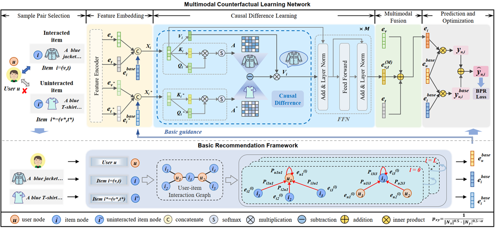

Ph.D. candidate   
[School of Computer Science and Information Engineering](http://ci.hfut.edu.cn/)  
[Hefei University of Technology](http://www.hfut.edu.cn/), Hefei, China  
 
 
**Email:** shuaiyangli96 AT gmail.com   

Biography
======
I'm a Ph.D. candidate from [Hefei University of Technology (HFUT)](http://www.hfut.edu.cn/). Before that, I received the Master degree from Northeast Electric Power University [(NEEPU)](http://www.neepu.edu.cn/) in 2018 and the B.Eng. degree from Henan Normal University [(HNU)](https://www.htu.edu.cn/) in 2014. My research interests include information retrieval, data mining, and multimedia analytics.

Researches
======
<!-- <tr>
<tr>
  <tr>
    <td>
      

        
      

    </td>
    <td valign="baseline">
      <b>Multimodal Counterfactual Learning Network for Multimedia-based Recommendation</b> 
      <strong>Shuaiyang Li<strong>, Dan Guo, Kang Liu, Richang Hong, and Feng Xue 
      The 46th International ACM SIGIR Conference on Research and Development in Information Retrieval (<strong>SIGIR</strong>), 2023
       
      [<a href="https://dl.acm.org/doi/10.1145/3539618.3591739" target="_blank">Link</a>]
      [<a href="../assets/SIGIR2023Li/paper.pdf" target="_blank">Paper</a>]
      [<a href="../assets/SIGIR2023Li/bib.html" target="_blank">BibTex</a>]
      [<a href="https://github.com/shuaiyangli/MCLN" target="_blank">Code</a>]
    </td>
  </tr>  -->
- Data Mining
- Recommender Systems
- Multimedia Analytics

Publications
======
**Conference papers:**  
- **_Shuaiyang Li_**, Dan Guo, Kang Liu, Richang Hong, and Feng Xue. Multimodal Counterfactual Learning Network for Multimedia-based Recommendation. The 46th International ACM SIGIR Conference on Research and Development in Information Retrieval (**SIGIR 2023**), 1539-1548. [[Link]](https://dl.acm.org/doi/10.1145/3539618.3591739)[[PDF]](../assets/SIGIR2023Li/paper.pdf)[[Code]](https://github.com/shuaiyangli/MCLN)

**Journal papers:**  
 
**Patents:**  
 

Experience
======
- 2021.09 ~ Now, Ph.D., School of Computer Science and Information Engineering [(SCSIE)](http://ci.hfut.edu.cn/), Hefei University of Technology, China.
- 2018.09 ~ 2021.06, Master, School of Electrical Engineering [(SEE)](https://ee.neepu.edu.cn/), Northeast Electric Power University, China.
- 2014.09 ~ 2018.06, B.Eng., College of Computer and Information Engineering [(CCIE)](https://www.htu.edu.cn/cs/main.htm), Henan Normal University, China. 
 

---

&copy; Shuaiyang Li 2023 &nbsp;&nbsp;&nbsp;&nbsp;&nbsp; Last updated on Jul. 19, 2023

